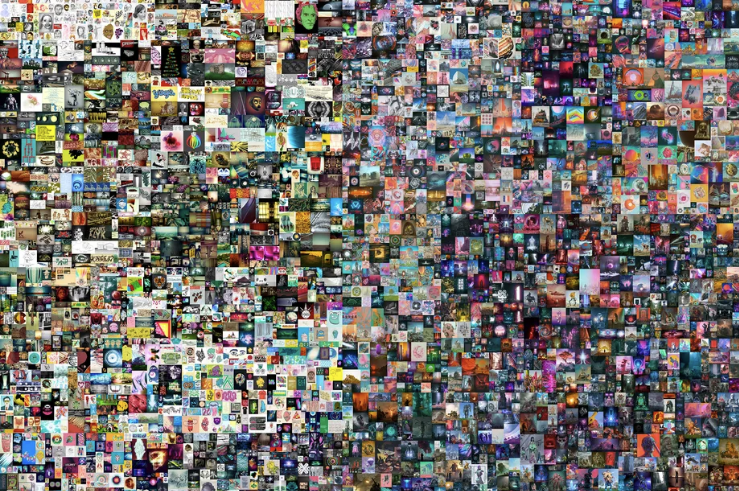

# NFT-Sniper
Buy rare NFTs faster than everyone else

 img[src$="centerme"] {
  display:block;
  margin: 0 auto;
}

## About NFT-Sniper

NFT-Sniper is a tool that help you spot rare nfts before everyone else. Sniper take advantage of the delay between the metadata update on blockchain and the transfer to opensea. There is an actual 15 to 30 minutes delay before the users see the traits of their NFT and most of them at that time sell their nfts at floor price. Sniper help you find those rare nfts, buy them and resell them right after few times x up 
